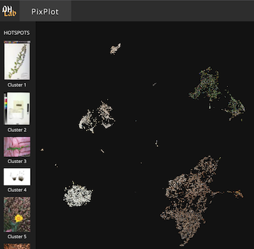
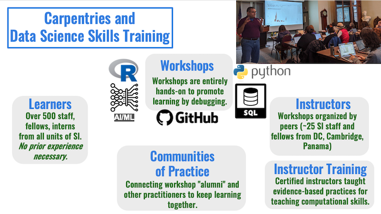

## Data Science at the Smithsonian

**Mike Trizna**

Smithsonian OCIO Data Science Lab

November 1, 2021 | *University of Richmond*

---

## What is the Smithsonian Institution?

Yes, there are the museums (19 of them, mostly in Washington, DC), but we also have 21 libraries and archives, 9 research centers ... and a zoo.

---

## Smithsonian Mission

Founded in 1846 from the bequest of Englishman James Smithson with the condition: 
> "under the name of the Smithsonian Institution, an establishment for the **increase and diffusion of knowledge**."

---

The researchers of the Smithsonian have been increasing and diffusing *Knowledge* since 1846.

---

How can we leverage *Insight* and *Wisdom* recorded by experts to make sense of growing amounts of *Data*?

---

## What is the Data Science Lab?

Located in the Smithsonian Office of the Chief Information Officer (OCIO), the OCIO
Data Science Lab acts as a "Lab" in the sense that it is:

* an environment producing high-quality scholarship and training new researchers
* a place to pilot new technologies and techniques with Smithsonian data and processes

---

## Who is the Data Science Lab?

*(Image of OCIO Data Science Lab participants circa Summer 2019)*

---

### Research: Genomics

---

### Research: Collections and Archives

---

## Pilot: Herbarium Sheet mercury detector

2017 paper that described building a machine learning model to detect herbarium sheets that had been stained with mercury.

https://doi.org/10.3897/bdj.5.e21139

---

### Pilot: Using Yale DHL PixPlot for Image Dataset Exploration

https://sidatasciencelab.github.io/mercury_sheets/

---

### Pilot: Example of Using SI Open Access Materials

Semantic Clustering American Art Paintings

Full interactive notebook (through Binder) available at https://github.com/sidatasciencelab/siopenaccess.

---

### Pilot: Amazonian Fish Classifier

Automated fish species classifier, supplemented with digitized museum specimens.

---

### Pilot: SI Gardens Tree Labeler

Winter project for SI horticulturalist to train models on tree-less photos of trees

---

### Pilot: American Women's History Initiative NLP

Using ML to learn complicated Mr./Mrs./Dr. titles

---

### Internal Training: The Carpentries

https://datascience.si.edu/carpentries

---

### Internal Training: Carpentries AI/ML for GLAM

https://carpentries-incubator.github.io/machine-learning-librarians-archivists/

---

## Questions?

Email: triznam@si.edu

Slides: https://github.com/MikeTrizna/richmond_datascience_talk

---

